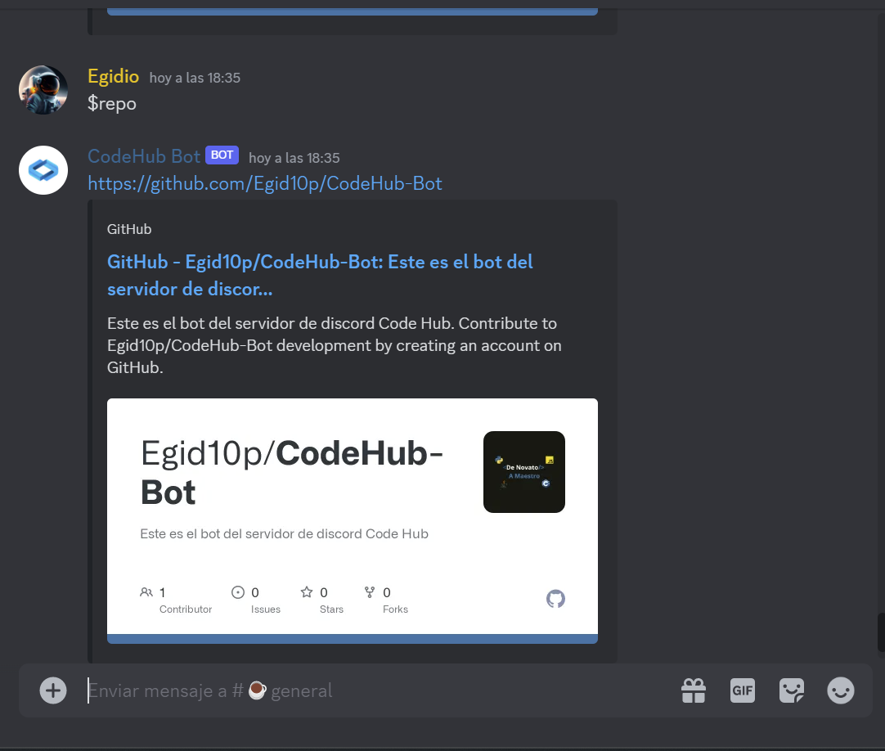
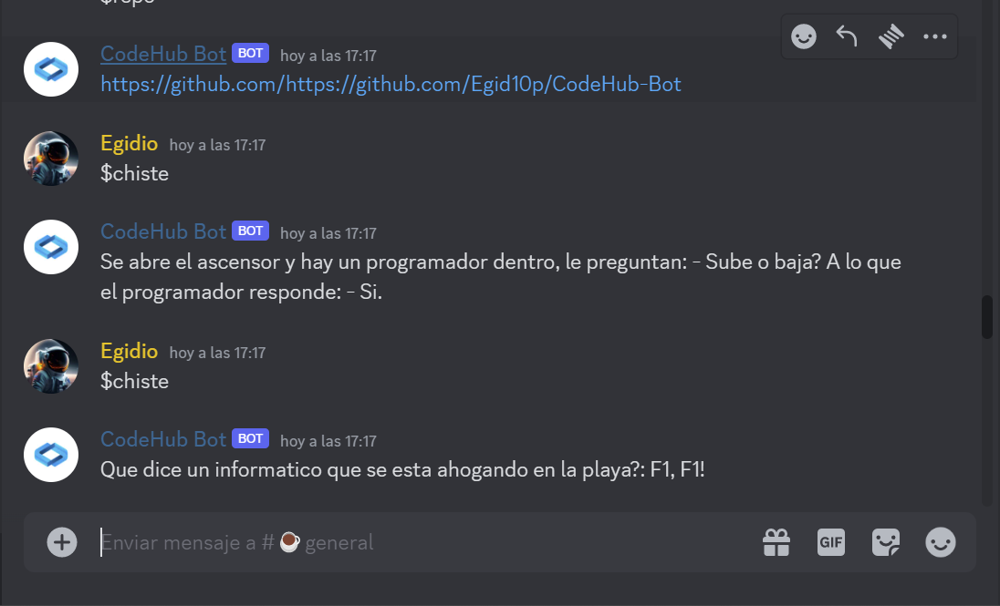

# CodeHub Bot
***
## Descripción
Este es un bot de discord diseñado para el servidor de discord de CodeHub. 
Este bot esta hecho con python 3.11 y la libreria discord.py
 

## Comandos y como usarlos
Este bot posee los siguientes comandos:

+ $help: Envia un mensaje con todos los comandos disponibles.
+ $conversor-moneda: Este comando tiene que tener los siguientes parametros--> cantidad moneda de origen y moneda de destino.
Aqui un ejemplo `$conversor-moneda 100 USD EUR`.
Este comando te ayuda a convertir monedas a otras y obtener su valor en dicha moneda.
+ $chiste: Al ejecutar este comando el bot te contara un chiste de programación
+ $repo: Al ejecutar el comando $repo el programa mostrara el link del repositorio en github
***
## Como agregalo a tu servidor
Puedes agregar el bot a tu servidor con este [aqui](https://discord.com/api/oauth2/authorize?client_id=1185642843084165180&permissions=8&scope=bot)
***
## Imagenes

***
