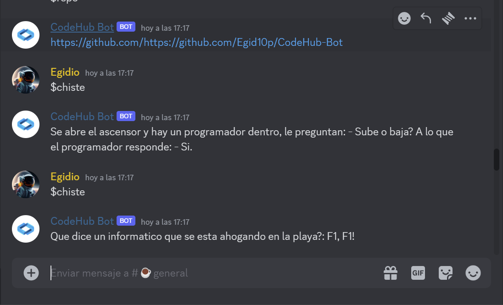

# CodeHub Bot

---

## Descripción

Este es un bot de discord diseñado para el servidor de discord de CodeHub. 
Este bot esta hecho con python 3.11 y la libreria discord.py
 

---

## Uso

En el servidor de Discord ejecuta `$help_me` para mostrar todos los comandos, el prefijo de todos y cada uno sera siempre un `$`

## Imagenes

---

